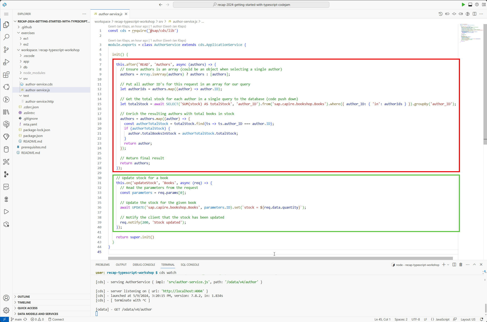
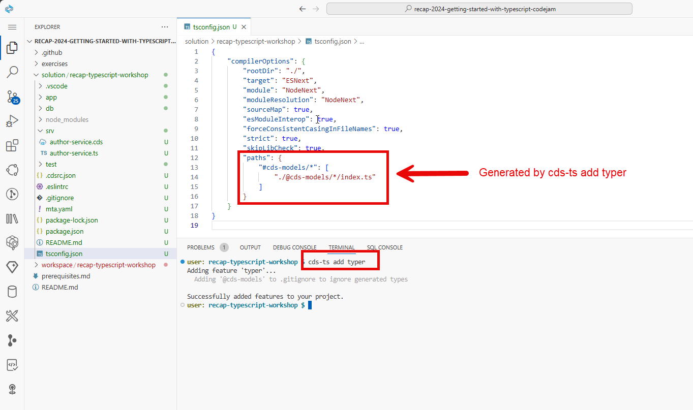
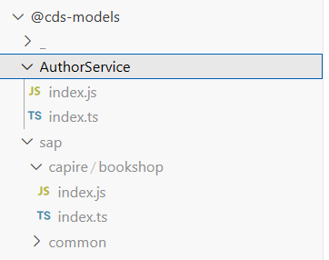
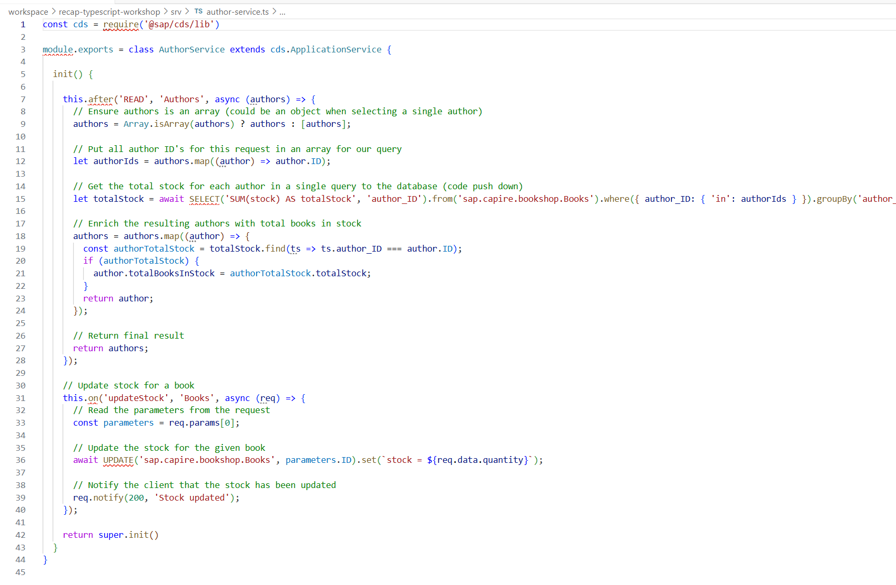
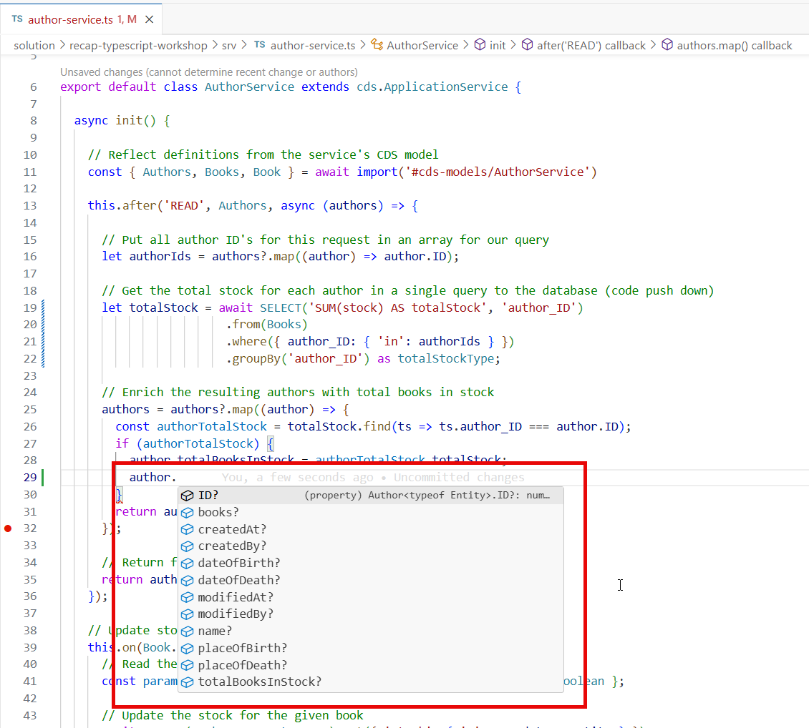
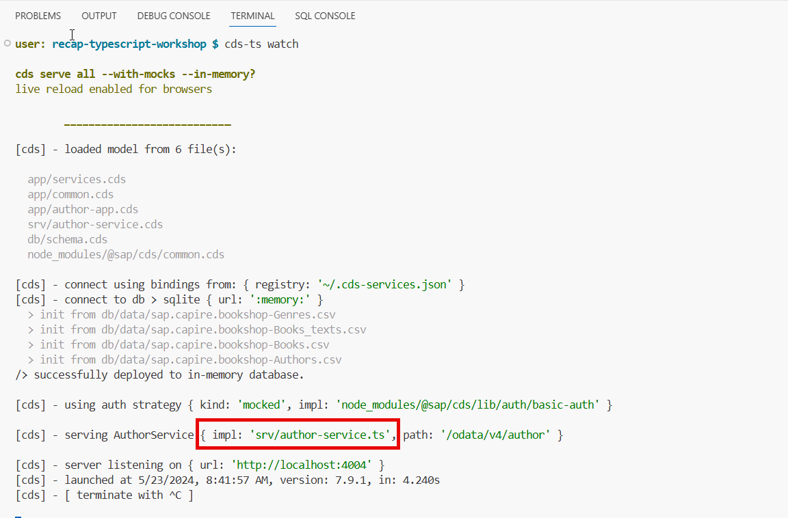

# Exercise 2 - Transforming the sample project to TypeScript

## Reviewing the current service implementation

Currently our service implementation is written in JavaScript. In the sample project, there are two handlers registered on two different entities of the service.

- After read handler for entity Authors (calculates the total amount of books in stock for an author and updates the virtual field totalBooksInStock)
- On updateStock handler for the action registered on entity books (the action allows us to update the stock of a book by providing the parameter quantity)



👉 Before enabling TypeScript in the project, try out the current code assistance options. You'll notice as in below example there's actually no real code assistance, just some suggestions.


## Enabling TypeScript for our project

Enabling TypeScript for a project is quite easy, the TypeScript compiler only needs a tsconfig.json file in the root of the project.

👉 Create a new file called tsconfig.json in the root of the project

👉 Copy below configuration in the file and save

```json
{
    "compilerOptions": {
        "rootDir": "./",
        "target": "ESNext",
        "module": "NodeNext",
        "moduleResolution": "NodeNext",
        "sourceMap": true,
        "esModuleInterop": true,
        "forceConsistentCasingInFileNames": true,
        "strict": true,
        "skipLibCheck": true
    }
}
```


## Running the project with TypeScript

👉  We're all set to launch our project & start testing our existing logic with TypeScript, launch the project by running the watch command and wait for the server to start (notice the slightly changed command cds -> cds-ts)

    cds-ts watch


Notice that the cds-ts command still loads the original JavaScript implementation? That's because we didn't change our implementation to TypeScript yet. We'll do so in the next chapters.

👉 Terminate the running server with CTRL + C (or CMD + C on MacOS)

## Adding the CDS typer to the project

Since we're going to use TypeScript, we'll need to create types for our existing data model / services. Sounds like a lot of work right?

Good news! SAP provides the [CDS typer](https://cap.cloud.sap/docs/tools/cds-typer) package to generate types for our data model & services! Let's go ahead and install the CDS typer package!

👉 Install the CDS typer with following command

    cds-ts add typer

Notice how our previously created tsconfig file is extended with additional information (location for our generated types):



👉 Manually add the typescript types for the @sap/cds module:

    npm add -D @cap-js/cds-types

👉 Manually generate the types for the existing project with following command:

    npx @cap-js/cds-typer '*' --outputDirectory @cds-models

If the command asks to install package @cap-js/cds-typer confirm with 'y':


👉 Explore the generate files in folder @cds-models



## Changing the service implementation from JavaScript to TypeScript

Changing the implementation from JavaScript to TypeScript is quite easy, changing the service implementation file extension is sufficient.

👉 Rename the service implementation file from author-service.js to author-service.ts


👉 Open the service implementation file (author-service.ts)

Notice a lot of typing errors? 
This is exactly what we're expecting and why we're using TypeScript! Let's solve them in the next steps!



## Converting the service implementation code to valid TypeScript

For the sake of simplicity, we'll just copy the solution code and in the handler and we'll highlight the changes in this step.

👉 Delete the contents of the current author-service.ts file

👉 Copy the contents from the solution [author-service.ts](../../solution/recap-typescript-workshop/srv/author-service.ts) and paste them in your own author-service.ts file

### Comparing the original JavaScript implementation vs TypeScript implementation

In this part of the tutorial we'll highlight the most important changes between the original JavaScript implementation and the new TypeScript implementation. I've intentionally added spacings in both files so that each statement of the original implementation is in the exact same line as in the TypeScript implementation so it can easily be compared.


In this overview, I'll use the source code line numbers and highlight the most important changes. (comparison is done using above screenshot, the actual files don't contain the additional spacing)

- line 1: Importing the CDS package using the import statement instead of the require statement. (Want to understand the difference between require & import? Check out following [link](https://medium.com/@interviewer.live/require-vs-import-in-node-js-understanding-the-difference-e45ae1d2e2d3))

- line 4: Re-usable type for the result of the total stock query (line 15) (used a re-usable type for illustration purposes, could have been an inline declaration)

- line 6: Replaced module.exports with export default statement (Want to understand the difference between module.exports & export default? Check out following [link](https://medium.com/@devq/the-difference-between-module-export-and-export-default-740039fed547))

- line 11: This is where it gets interesting, in this statement we're importing the generated types using a dynamic import statement to reference further down the line. ([Documentation](https://cap.cloud.sap/docs/tools/cds-typer#subpath-imports) on why to use dynamic imports instead of static imports)

- Line 13 & 38: Notice how the registration of the handlers change from a string-based entity to an object we imported in line 11 (e.g. 'Authors' becomes Authors)? By doing so CAP is able to make the request objects typed, which allows us to use code completion as well!

- Line 20 & 43: Notice how the entities are referenced by their imported objects instead of a string-based implementation? CAP is able to determine the right entity based on the imported object.

👉 Try-out the code completion by e.g. re-doing the same test as we did in step one



## Running the project with TypeScript

👉  We're all set to launch our project & start testing our updated logic with TypeScript, launch the project by running the watch command and wait for the server to start.

    cds-ts watch



Notice that the cds-ts command now loads our TypeScript service implementation?

👉 Terminate the running server with CTRL + C (or CMD + C on MacOS)

This concludes the most important part of this workshop, we've now succesfully converted our existing JavaScript project to TypeScript, introducing type-safety & code-completion for our development! In the next exercises we'll add a TypeScript-based Fiori Elements Template to the project and run both the CAP backend and UI5 frontend with TypeScript in a local launchpad.